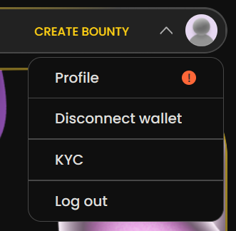

# ✍ Setting up your profile

The first thing you should do before starting to use Heroes is to set up your own profile.

<figure><figcaption></figcaption></figure>

If a red exclamation shows, your attention is needed to set up your profile! Then click to get sent to your profile page, where you can be sent on to the profile setup page:

<figure><figcaption></figcaption></figure>

On the profile setup page you can either sign up as a company or an individual. Only company name vs Full name, and company site/Personal Github link are the only differences. On both you will be required to give the full legal name of either yourself or the company, as well as country, correct address, and VAT. These are for legal purposes if you take up bounties where an invoice will be generated. This invoice can be used to declare your own tax for your money earned easier.
